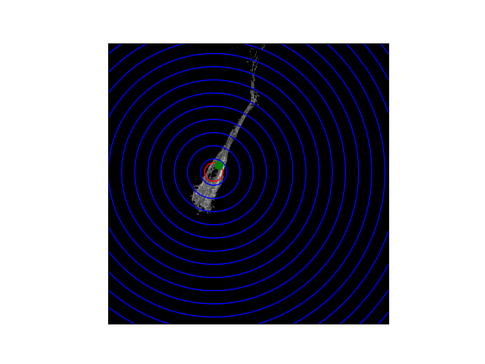
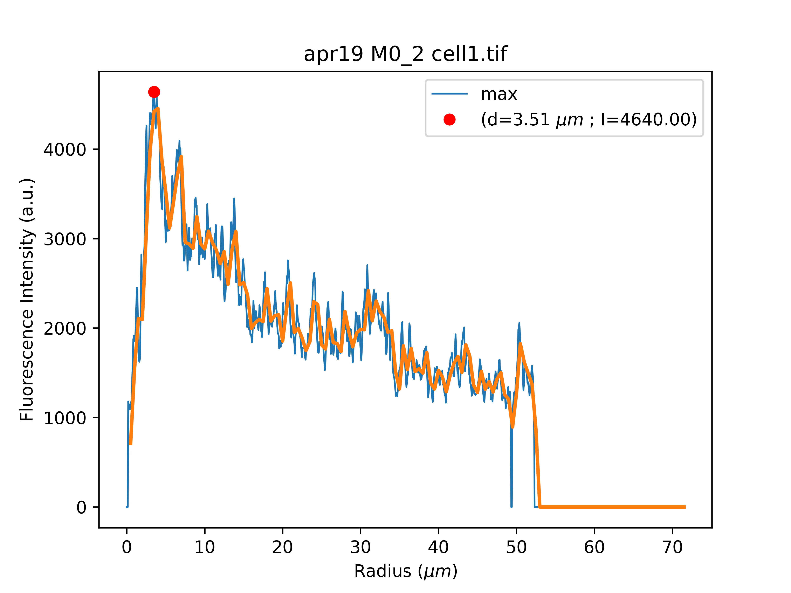

# radialProfile
Python script for computing the maximum intensity radial profile of cells from pictures.
The maximum intensity radial profile is a profile plot of the maximum intensity pixel among concentric circles as a function of distance from a center in the image.
This script can retrive the radial profile of more than one cell in a picture, but it requires a cell mask and a center for each cell.

The `radialProfile.py` script generates two pictures for each cell in the image folder:

<p align="center">


</p>

The first figure shows concentric blue circles overlaying the original image.
Assuming a pixel size of 0.065 micron, the blue circles radii are multiples of 5 micron.
The green dot indicates the center of the circles and on which the radial profile is computed.
The red circle indicates the circle with the most intense pixel.
The second figure is the maximum intensity radial profile plot computed assuming a pixel size of 0.065 micron.
To change the pixel size value change line 210 `pixelSize = 0.065 #size of the pixel in microns`.

The `radialProfile.py` script assumes that all required files are organized in folders in a specific way:
```
radialProfile/
│   README.md
│   radialProfile.py  
│
└───Exp1/
│   │   coordinates.txt
│   │
│   └───Image1/
│   |       image.tif
│   |       cell1.tif
│   |       cell2.tif
│   |       cell3.tif
│   |       ...
│   └───Image2/
│   |       image.tif
│   |       cell1.tif
│   |       cell2.tif
│   |       ...
|   └───....
|
└───Exp2/
│   │   coordinates.txt
│   │
│   └───Image1/
│   |       image.tif
│   |       cell1.tif
│   |       cell2.tif
│   |       cell3.tif
│   |       ...
|   └───....
└───....
```

In order for it to work, the `radialProfile.py` script must be located in a main folder, e.g. `radialProfile/`.
The `radialProfile.py` script assumes that you are analysing multiple acquired regions of a
sample, each acquired image has to be saved as `image.tif` in a dedicated folder e.g. `Image1/`,`Image2/`, or other.
Each folder that contains an acquired region must be itself placed in a folder that refers to the related sample, e.g. `Exp1/`.
It is important to notice that the image file name must always be `image.tif`. 
In a further implementation, we may want to make this requirement less strict.
The cell masks that identify different cells in the same acquired region must be saved as tiff images 
with the file name `cell1.tif`, `cell2.tif`, and so on.
Be aware that the cell masks tiff files must be saved in
the same folder as the image.tif files to which they have to be applied.
For the script to work correctly, in each sample folder there has to be a txt file named
`coordinates.txt`. It is recommended to write it as a tab-separated-values file composed of
four columns: the first column must indicate the image folder names, the second column
must contain the cell mask names, and the third and fourth columns must indicate the x
and y coordinates which will define the centers for the radial profile calculation. These x
and y coordinates will therefore define the radial profile origin for each cell.

Here is an example for `coordinates.txt`:
```
Image1	cell1	615	750
Image1	cell2	1251	915
Image1	cell3	495	1194
Image2	cell2	626	402
Image2	cell3	972	1158
```
The git repository also contains an example of two images taken in a single experiment that can be used to test the script. The directory organization of the example is:
```
radialProfile/
│   README.md
│   radialProfile.py  
│
└───apr19/
    │   coordinates.txt
    │
    └───M0_2/
    |       image.tif
    |       cell1.tif
    |       cell2.tif
    |       cell3.tif
    |
    └───M0_4/
            image.tif
            cell2.tif
            cell3.tif
```
To run the script simply execute:
```
python radialProfile.py
```
The file will generate three files in the main folder: `profiles.txt` contains the radial profiles for each cell, `profilesSmooth.txt` contains the smoothed profiles, and `eccSols.txt` contains the solidity and eccentricity of the cells.
`profiles.txt` and `profilesSmooth.txt` are organized as tab separated values tables. The first row is the header, each other row corresponds to a different cell. The first 3 columns identify respectively the experiment, the image, and the cell. The other colums in the header identify the radial profile radius, and in the cell rows the cooresponding values.


### Requirements
- matplotlib
- scikit-image
